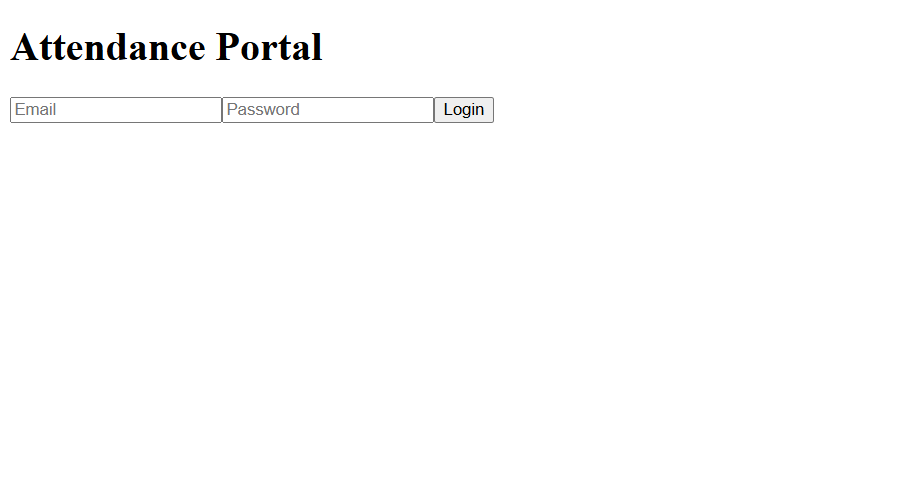
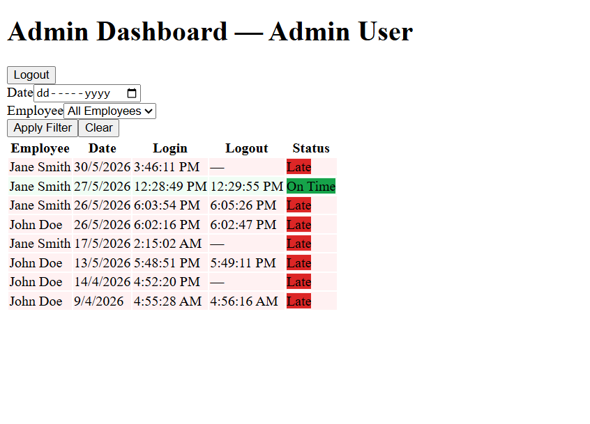

# Employee Attendance Dashboard

A full-stack web application for tracking employee attendance with role-based access control. Employees can punch in and out, and admins can view color-coded attendance records filtered by date or employee.

## 🔗 Live Demo
- **Frontend:** https://attendance-dashboard-eight.vercel.app
- **Backend:** https://attendance-dashboard-api.onrender.com

> ⚠️ Backend is hosted on Render free tier - first request may take ~30 seconds to wake up.

---

## ✨ Features

- JWT authentication with httpOnly cookies
- Role-based access control - Admin and Employee
- Employee punch-in / punch-out with timestamp
- Auto status - 🟢 On Time (before 8AM) / 🔴 Late (after 8AM)
- Admin dashboard with color-coded attendance records
- Filter records by date and employee
- Prevents duplicate punch-in on the same day
- Fully deployed - Vercel + Render

---

## 🛠️ Tech Stack

| Layer | Technology |
|---|---|
| Frontend | React, Vite, TailwindCSS, Axios |
| Backend | Node.js, Express |
| Database | PostgreSQL (Supabase) |
| Auth | JWT, httpOnly Cookies, bcrypt |
| Deployment | Vercel (Frontend), Render (Backend) |

---

## 📁 Project Structure

```
attendance-dashboard/
  client/                  ← React frontend (Vite)
    src/
      pages/               ← LoginPage, EmployeeDashboard, AdminDashboard, NotFound
      components/          ← ProtectedRoute, Spinner
      api/                 ← axiosInstance, auth.api, attendance.api
  server/                  ← Express backend
    routes/                ← auth.routes, attendance.routes, admin.routes
    controllers/           ← auth.controller, attendance.controller
    middleware/            ← authMiddleware, roleGuard
    db.js                  ← Supabase PostgreSQL connection
```

---

## ⚙️ Local Setup

### Prerequisites
- Node.js v18+
- Supabase account (free) - https://supabase.com

### 1. Clone the repo

```bash
git clone https://github.com/yourusername/attendance-dashboard.git
cd attendance-dashboard
```

### 2. Backend Setup

```bash
cd server
npm install
```

Create a `.env` file inside `/server`:

```
DATABASE_URL=your_supabase_connection_string
JWT_SECRET=your_jwt_secret
PORT=5000
```

Start the server:

```bash
npm run dev
```

Server runs on `http://localhost:5000`

### 3. Frontend Setup

```bash
cd client
npm install
npm run dev
```

App runs on `http://localhost:5173`

---

## 🗄️ Database Schema

### users
| Column | Type | Notes |
|---|---|---|
| id | UUID | Primary Key |
| name | VARCHAR(100) | Display name |
| email | VARCHAR(150) | Unique, used for login |
| password_hash | TEXT | bcrypt hashed |
| role | VARCHAR | `admin` or `employee` |
| created_at | TIMESTAMP | Auto set |

### attendance
| Column | Type | Notes |
|---|---|---|
| id | UUID | Primary Key |
| user_id | UUID | FK → users.id |
| login_time | TIMESTAMP | Punch-in time |
| logout_time | TIMESTAMP | Null until punched out |
| date | DATE | For uniqueness check |
| status | VARCHAR | `on_time` or `late` |

> Constraint: `UNIQUE(user_id, date)` - one record per employee per day

---

## 🔌 API Endpoints

| Method | Endpoint | Auth | Description |
|---|---|---|---|
| POST | /auth/login | None | Login, sets JWT cookie |
| POST | /auth/logout | Any | Clears JWT cookie |
| GET | /auth/me | Any | Returns logged-in user info |
| POST | /attendance/punch-in | Employee | Records login time |
| PATCH | /attendance/punch-out | Employee | Updates logout time |
| GET | /attendance/me | Employee | Today's record |
| GET | /attendance/all | Admin | All records with filters |
| GET | /admin/employees | Admin | List of all employees |

---

## 📸 Screenshots





---

## 🔑 Test Credentials
Contact the author for demo access credentials.

---

## 📚 What I Learned

- REST API design with Express and PostgreSQL
- JWT authentication with httpOnly cookies
- Role-based access control with middleware
- React Router with protected routes
- Connecting React frontend to a Node.js backend
- Deploying full-stack apps on Vercel + Render

---

## 👨‍💻 Author

**Darshan R**  
[GitHub](https://github.com/darshanr27)
